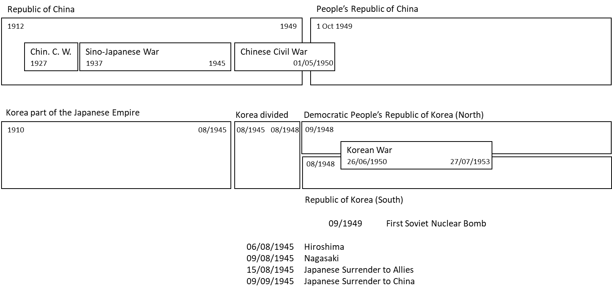
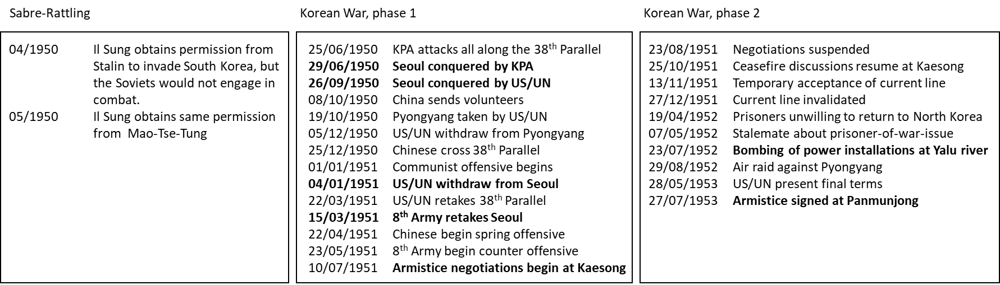

## The Way to the Korean War

*Johannes Siedersleben, Oxford, August 2015*

When World War II was won, the Western Allies were looking helpless and appalled at what was 
going on in Eastern Europe: states disappeared one by one in the dark fog of totalitarianism. 
Each of the following events was a blow for the western countries and a victory for Communism:

1. Albania in January 46 (People's Socialist Republic of Albania)
2. Yugoslavia in January 46 (Socialist Federal Republic of Yugoslavia)
3. Bulgaria in October 46 (People's Republic of Bulgaria)
4. Poland in January 47 (Polish People's Republic)
5. Romania in December 47 (People's Republic of Romania)
6. Czechoslovakia in February 48 (Victorious February)
7. Hungary in August 49 (Hungarian People's Republic)
8. East Germany in October 49 (German Democratic Republic)
9. China in October 49 (Communists win the Chinese Civil War)

The Western Allies found themselves in the situation of a chess player left with only half of his pieces
after few moves. Churchill said in March 1946 that “from Stettin in the Baltic to Trieste 
in the Adriatic, an iron curtain has descended across the continent”, giving the world a new word. 
On March 12, 1947 Truman announced his Doctrine to the Congress, stating that “it must be the policy of 
the United States to support free people who are resisting attempted subjugation by armed minorities or
by outside pressures”. The Cold War had begun. The London Council of Foreign Ministers 
(November/December 1947) was held in an atmosphere of utter gloom: Molotov proposed an early 
reunification of Germany under the auspices of the Soviet Union refusing any participation in 
the ERP (European Recovery Programme) whereas the other representatives opposed any plan that would draw
Germany away from Europe. The Yugoslavia-Soviet split in 1948 was a small consolation at best: Tito
was happy to receive American money (not part of the Marshall Plan) while remaining an independent 
communist state. The Berlin Airlift from June 1948 till May 1949 contributed considerably to further 
rising the tension. The North Atlantic Treaty was signed in April 1949, the first Soviet nuclear
bomb successfully tested in September 1949. In January 1950, Molotov, the Soviet delegate, walked
out of the UN Security Council in protest against the UN’s refusal to seat Communist China in place of
the Kuomintang, making clear that Communist China and the Soviet Union constitute one huge, inseparable block.

Within less than four years, the post-war world had completely changed: the former fiends, Germany
and Japan, were torn to pieces and virtually inexistent. But a former ally, the Soviet Union, had
turned into a formidable fiend threating the world more than the Nazis or Japanese had ever done.
And there was China, a huge, unknown, incalculable power far away in the East. The western 
countries were scared, closely observing countries susceptible to Communism and looking out for signs of
defection. Greece and Turkey were particularly at stake.

The deep fear of Communism and the paranoid chase for communists prevailing in these days can
thus be explained. A World War III opposing the West and the East and fought with nuclear weapons
was expected by many. This didn’t happen. Instead it was the Korean War which opposed the super
powers, allowing them to pit their strength against each other. With over 3 million dead it would be
cynical to call the Korean War a test case, but in fact it was one, utterly dissuasive for whoever was
fancying a full-scale war. The Korean War led to a stalemate, a stalemate to be continued on a world
wide scale until the fall of the iron curtain. In order to understand the facts better let us see what
happened in the Far East, with China, Japan and Russia as the main stakeholders (Figure 1).

China’s history since 1927 is a good example of the one-war-at-a-time-rule, a rule famously broken by 
Napoleon and Hitler. The Republic of China was very busy with its ferocious Civil War 
opposing the Nationalists under Chiang-Kai-Shek and the Communists under Mao Zedong. 
But in 1937 the Sino-Japanese War cut in, thwarting domestic hostilities 
for seven years. The Nanking massacre in December 1937 is still a daunting example of cruelties against 
civilians. Unmolested by World War II after 1945, the Chinese quickly resumed their Civil
War which came to an uneasy, unofficial truce in May 1950. To this day no armistice or peace treaty
has ever been signed. There are, as a consequence, two Chinas: People's Republic of China on the
mainland and Republic of China in Taiwan. The Japanese, who had occupied much of China, 
were annihilated by the Allies, suffered two nuclear bombs, and finally surrendered unconditionally to their
enemies. They had dreamt of the Greater Eastern Asia Co-Prosperity Sphere, a block of Asian nations
led by the Japanese and free of Western powers.

A cornerstone of Japan’s imperial aspirations was Korea. Japan had made it its protectorate with the
Japan-Korean annexation treaty in 1910. Korea was considered to be part of the Empire of Japan as
an industrialized colony along with Taiwan. The Japanese attempted the cultural assimilation of 
Korea’s 23.5 million people by banning the use and study of the Korean language, literature and culture.
Conscriptions of Koreans for labour in war industries began in 1939 with 2 million Koreans conscripted 
to either the Japanese Army or Japanese labour force. During World War II, Japan used Korea’s livestock, 
food and metals for their war effort.

Many Koreans fled to China, and a Provisional Government of the Republic of Korea was founded under 
the auspices of the Chinese Nationalists. Its leader was a man called Syngman Rhee. The Soviet
Union declared war to Japan, almost dead, on August 9, 1945. The Red Army began immediately to
occupy the northern part of the Korean peninsula. Japan’s defeat meant liberation for Korea. 
The division into North and South Korea was negotiated on August 10 between the US army and the Red
Army. They chose the 38th Parallel. They were allies at that time, and the Red Army were 
waiting patiently three weeks for the American troops to turn up at the appointed location.

Korea’s future was one of the subjects discussed at the Moscow Conference in December 1945 with
Molotov (Soviet Union), Bevin (UK) and Byrnes (US) as participants: a Joint Commission of Soviets
and Americans would be set up to make recommendations of a single free government in Korea. But
Korea would gain independence not before the end of a five-year trusteeship. Syngman Rhee, back
home and now leader of the Representative Democratic Council, argued against the trusteeship: 
Korea had suffered too long. The trusteeship was in fact abandoned. In North Korea, the Soviets 
installed Kim Il-sung as head of the Provisional People’s Committee in September 1945. Korea’s 
division happened gradually during the three years which followed. Those siding with Syngman Rhee
went to the South governed by the US Army Military Government in Korea (USAMGK) while the communists 
went to the North still under the Red Army. And, as we have seen, the breach between the
US and the Soviets deepened steadily during this period. General elections were held in South Korea
on May 10, 1948, in North Korea the same year on August 25. South Korea’s constitution took effect
on July 17, 1948 and Syngman Rhee was elected president. The first thing Rhee did was to expel any
remaining communists who fled to the hills to prepare for a Guerilla War. The Democratic People's
Republic of Korea was proclaimed on September 9, 1948, with Kim as premier. The first thing Kim did
was a land reform, making former landowners to flee to the South. On October 12, the Soviet Union
declared that Kim's regime was the only lawful government on the peninsula.

Then began a period of sable-rattling with various skirmishes along the 38th Parallel. Kim Il-sung 
obtained permission if not an order from Stalin and from Mao to attack the South. But in spite of that
Korea was not yet in the focus of the Americans: in January 1950, Acheson had carelessly excluded
South Korea from the defence perimeter of American vital interests in the Far East. There was also a
visible lack of enthusiasm for Rhee’s autocratic regime.

Korea entered the focus of interest abruptly on June 25, 1950 when the Korean People’s Army (KPA)
attacked the South. The American secretary of State, Dean Acheson, called the North Korean attack
“an undisguised challenge to our internationally position as the protector of South Korea”. The UN
Security Council shared this opinion and passed the same day a resolution condemning the North Korea 
attack and calling for withdrawal by an unprecedented 9-0 vote, the only dissenter (Molotov) being absent. 
Truman immediately decided that South Korea would be provided with whatever arms
they needed and extended the area of command of America’s Supreme Commander in the Far East,
Douglas MacArthur, to include Taiwan. MacArthur complained later on about the manner in which
these great decisions were made, without even consulting the field commander involved, himself. On
June 27, a second resolution was passed by the UN Security Council calling upon the UN members to
“render such assistance to the Republic of Korea as may be necessary to repel the armed attack and
to restore international peace”, this time with a 7-1 vote and one abstention by Yugoslavia. The only
country to follow this request was Great Britain sending her Far East Fleet to join America’s warships
and supplementing 325.000 American troops with 14,000 British, with the number of South Korean
soldiers around 600,000. On the other side, the Chinese played a huge role in assisting North Korea
while the Soviets never turned up, at least not openly.

The subsequent war was fought in two phases (Figure 2). The first phase can be seen as four swings
of a pendulum: The North Koreans come in and take Seoul (first swing). The Americans come in and
relieve Seoul (second swing). The Chinese, meanwhile communist, come in and retake Seoul (third
swing). The Americans start a counter-offensive and relieve Seoul (fourth swing). The second phase
of the war was an uneasy stalemate, marked by frequently interrupted negotiations and repeated air
raids of the Americans. An important issue was the handling of prisoners of war held by the South
and unwilling to return home. The war ended officially on July 27, 1953 with an armistice signed at
Panmunjong. It established a demilitarised zone, returned the city of Kaesong to North Korea which
lost a net of 3,900 km2 to South Korea. The Korean War had come to an end, but the iron curtain
should remain closed for another 40 years. And the Korean division persists to the present.